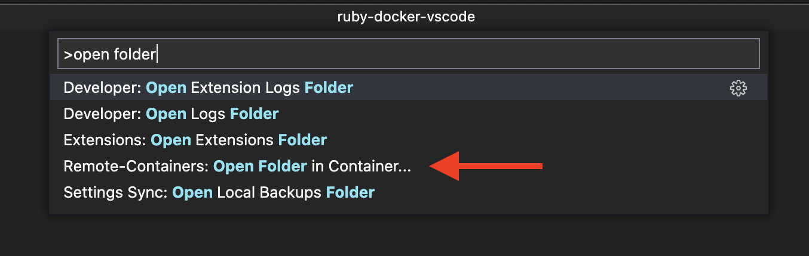

# VSCode + Docker + Ruby debugging

## Prerequisites
- Docker

- VSCode

- The [VSCode extension for developing in Docker containers](https://marketplace.visualstudio.com/items?itemName=ms-vscode-remote.remote-containers)

## Installation
1. Clone the repo.

1. In VSCode's [command palette](https://code.visualstudio.com/docs/getstarted/userinterface#_command-palette), open your project's folder in a Docker container.
    

## Use
You can run with or without debugging as you normally would. When a breakpoint is reached during a debug run, 
- View -> Run will show you local state

- View -> Debug Console will give you a REPL with local state as well as showing program output

## Customization
- ./devcontainer/devcontainer.json contains a list of VSCode extensions that will automatically
be added to the Docker container when it is created. Modify this list to manage your 
extensions.

- You can replace test.rb with a useful program 🙂. With any Ruby file selected in the editor, running with or without debugging will run the currently active file. To instead always run a project's entrypoint Ruby file regardless of the editor state, modify the "program" key-value pair in ./vscode/launch.json with the name of your top-level Ruby file.
